<!--
  ============================================================
   16-BIT PIXEL ART SPACE ARCADE PROFILE  --  VaibhavWaghela-AI
   Commit this file as README.md in a repo named exactly:
   VaibhavWaghela-AI/VaibhavWaghela-AI
   Keep the assets/ folder next to it.
  ============================================================
-->

<!-- ============ 1. TITLE SCREEN ============ -->

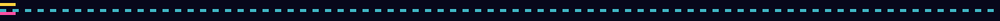

<!-- ============ 2. RPG DIALOGUE BOX ============ -->
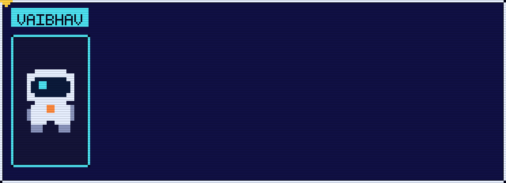

<!-- ============ 3. PLAYER HUD ============ -->
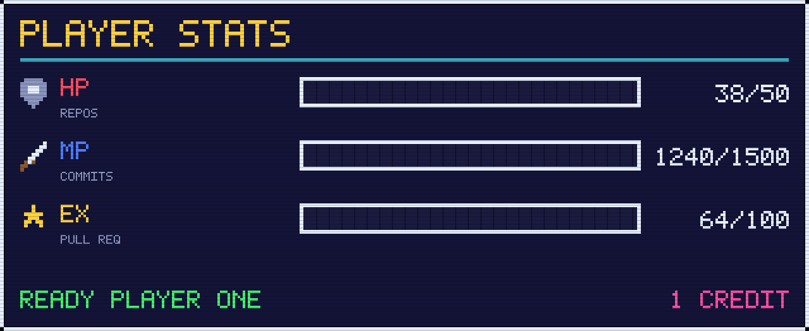

<!-- live numbers, arcade-themed -->
<!--  -->
 -->

<!--  -->

<!-- ============ 4. EXPLORED SECTORS (CONTRIBUTIONS) ============ -->
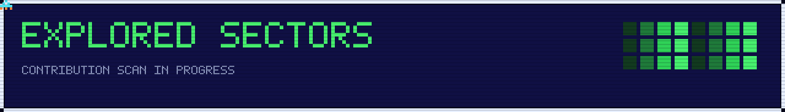

<!-- ============ 5. INVENTORY (SKILLS) ============ -->
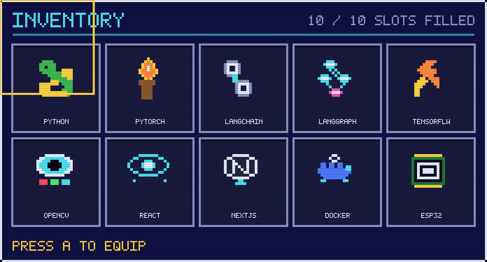

<!-- ============ 6. ANIMATED ARCADE HUD PANELS ============ -->


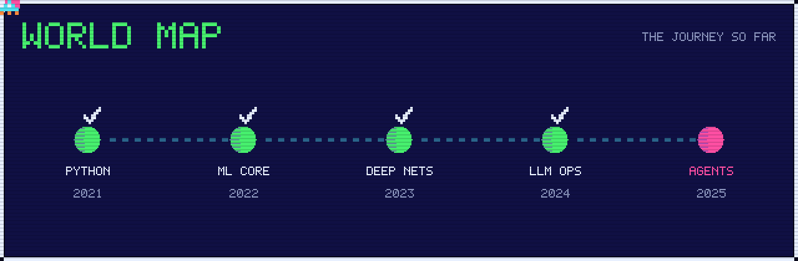



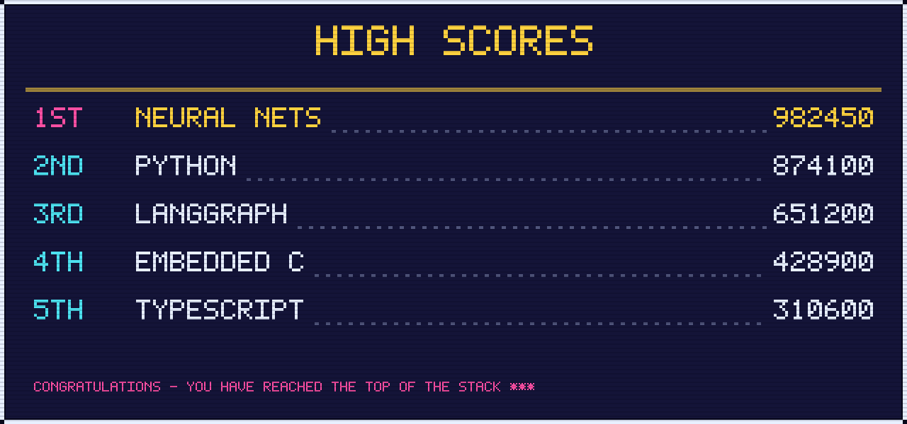

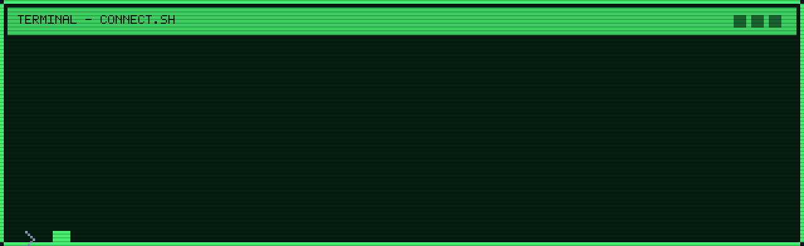

## `>` SIDE QUESTS &nbsp;(featured builds)

<!-- 

-->

| SLOT | QUEST | LOOT DROPPED |
| :--: | :---- | :----------- |
| `01` | Neural net training pipeline | PyTorch, CUDA, W&B |
| `02` | Multi-agent LangGraph system | LangChain, LangGraph, RAG |
| `03` | ESP32 edge-AI artifact | C++, TinyML, MQTT |

<!-- ============ 6. GAME OVER / CONTACT ============ -->
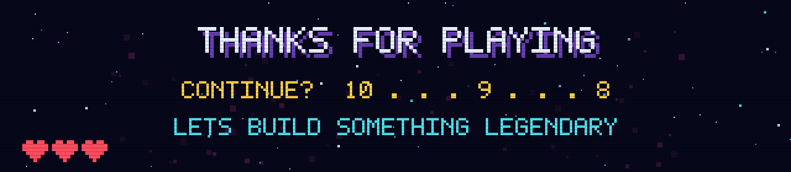

