<!--
  ============================================================
   16-BIT PIXEL ART SPACE ARCADE PROFILE  --  VaibhavWaghela-AI
   Commit this file as README.md in a repo named exactly:
   VaibhavWaghela-AI/VaibhavWaghela-AI
   Keep the assets/ folder next to it.
  ============================================================
-->

<!-- ============ 1. TITLE SCREEN ============ -->


<!-- ============ 2. RPG DIALOGUE BOX ============ -->
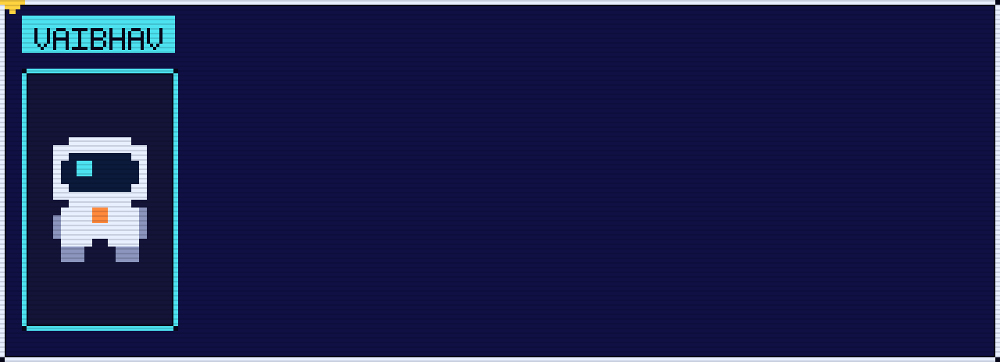

<!-- ============ 3. PLAYER HUD ============ -->
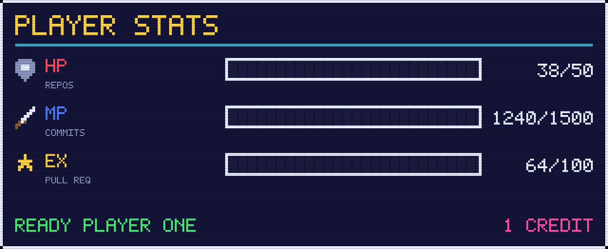

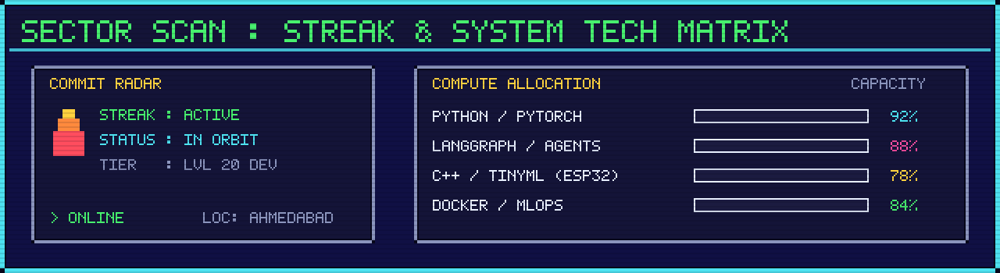

<!-- ============ 4. EXPLORED SECTORS (CONTRIBUTIONS) ============ -->
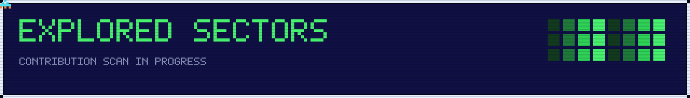

<!-- ============ 5. INVENTORY (SKILLS) ============ -->
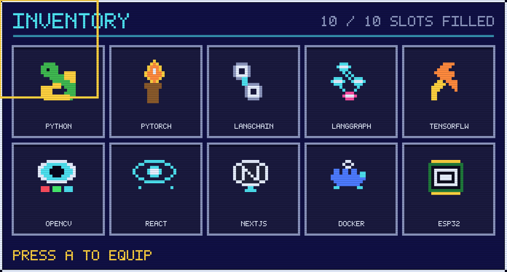

<!-- ============ 6. ANIMATED ARCADE HUD PANELS ============ -->




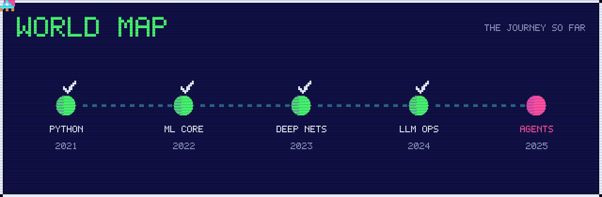





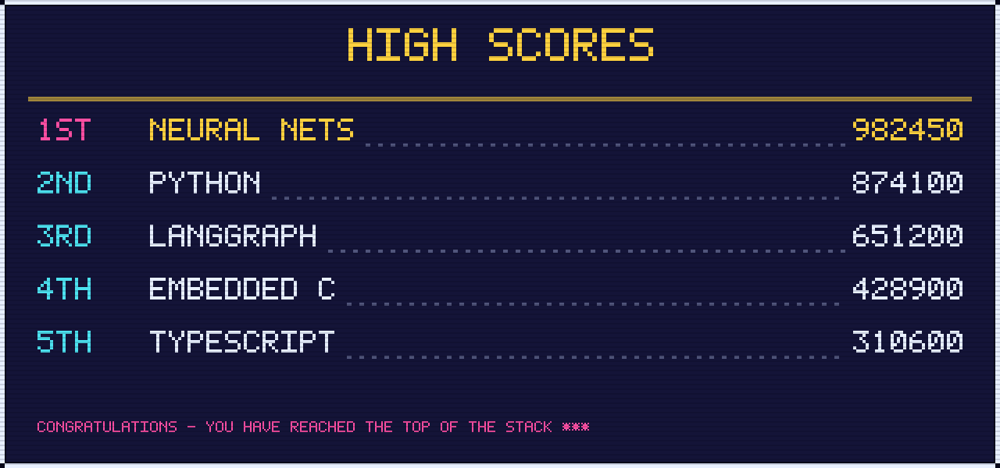

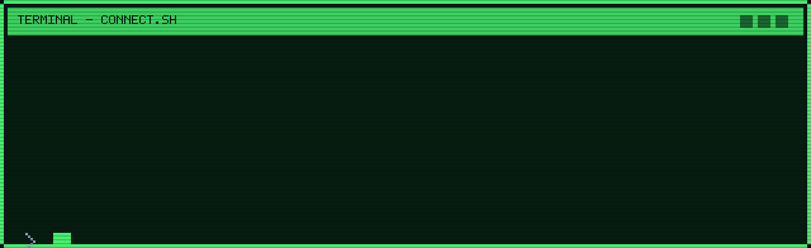

<a href="https://github.com/VaibhavWaghela-AI/PolyForge">
  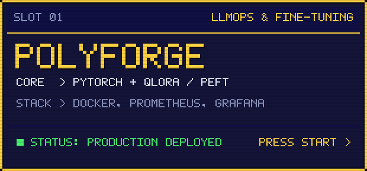
</a>
<a href="https://github.com/VaibhavWaghela-AI/Aura--MCP-driven-multi-agent-workspace-daemon">
  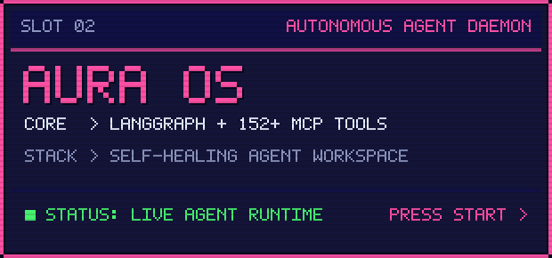
</a>
 
<a href="https://github.com/VaibhavWaghela-AI/Gesture_controlled_AI">
  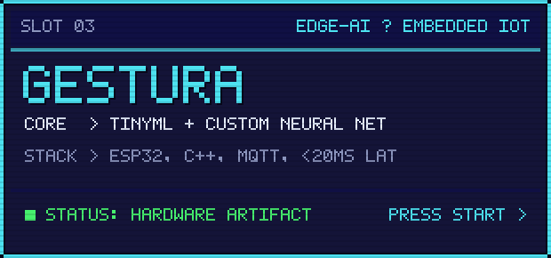
</a>
<a href="https://github.com/VaibhavWaghela-AI/Multi__Agent_Medical_Chatbot">
  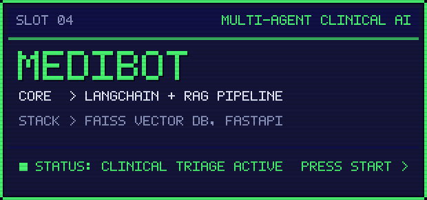
</a>

<!-- ============ 6. GAME OVER / CONTACT ============ -->
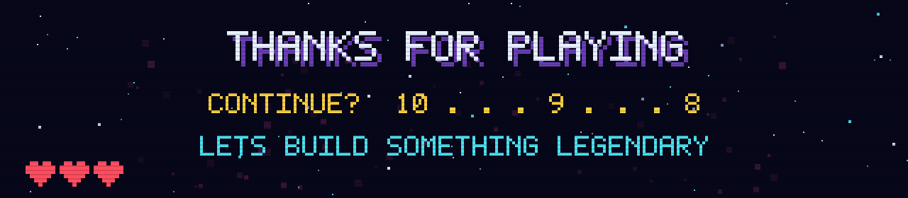

